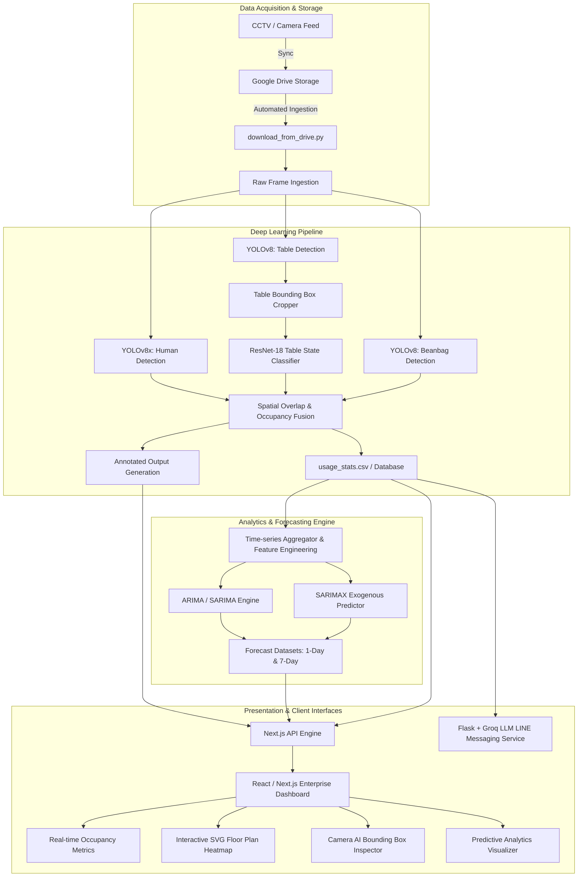

# CO-AI WANGMAI: Enterprise Occupancy Intelligence & Spatial Analytics Platform

An enterprise-grade, computer-vision-driven spatial monitoring and occupancy analytics platform designed for co-working facilities and institutional spaces. The system automates real-time occupancy counting, table-level availability tracking, time-series capacity forecasting, and multi-channel alerting.

---

## 1. System Architecture

The platform adopts a decoupled microservice-ready architecture comprising an edge acquisition layer, deep learning inference engine, time-series forecasting service, full-stack web dashboard, and automated notification integrations.



---

## 2. Technology Stack

### Computer Vision & Deep Learning
- **YOLOv8 (Ultralytics)**: Object detection for person tracking, table localization, and beanbag positioning.
- **PyTorch & Torchvision**: Convolutional Neural Network execution (`ResNet-18`) fine-tuned for table occupancy classification (FREE vs. USED).
- **OpenCV & Pillow**: High-throughput image transformation, bounding box rendering, and spatial geometric intersection (IoU).

### Analytics & Time-Series Forecasting
- **Statsmodels & Scikit-Learn**: Mathematical modeling utilizing ARIMA, SARIMA, and SARIMAX algorithms.
- **Pandas & NumPy**: High-performance temporal aggregation, data cleaning, and holdout validation.

### Web Application & User Experience
- **Framework**: Next.js 15 (App Router, Server-Side API Handlers, Static Optimization).
- **UI Engine**: React 19, TypeScript, Tailwind CSS v4.
- **Styling Architecture**: Glassmorphic dark aesthetic, hardware-accelerated transitions, and SVG spatial mapping.
- **Component Utilities**: Lucide Icons, clsx, tailwind-merge.

### Pipeline Orchestration & Integrations
- **Apache Airflow**: Workflow DAG automation for periodic sync, inference, and model retuning.
- **LINE Messaging API & Flask**: Conversational notification webhook service.
- **Groq LLM SDK**: Large language model integration for natural language occupancy queries.
- **Containerization**: Docker and Docker Compose for production deployments.

---

## 3. Core Functional Capabilities

### Real-Time Spatial Occupancy Monitoring
- Continuously tracks total human count, individual table occupation status, and auxiliary lounge usage.
- Computes aggregated occupancy ratios and load levels (Low, Moderate, Crowded).

### Interactive Spatial Floor Plan
- Architectural 2D visual representation of the workspace facility with dynamic status color-coding.
- Individual desk status inspection with metadata support (seat capacity, power outlet accessibility, and operational zone).

### Visual Verification & Timeline Inspector
- Complete audit trail of processed frames with overlay bounding boxes.
- Interactive timeline scrubber allowing facility operators to review historical spatial patterns at any recorded timestamp.

### Predictive Capacity Planning
- Quantitative short-term (24-hour) and medium-term (7-day) occupancy forecasts.
- Automated validation scoring using Root Mean Square Error (RMSE), Mean Absolute Error (MAE), and Mean Absolute Percentage Error (MAPE).

---

## 4. Project Directory Structure

```
CO_AI_WANGMAI/
├── dags/                           # Apache Airflow workflow definitions
│   └── coworking_pipeline.py       # Automated pipeline DAG
├── forecast/                       # Time-series training and evaluation scripts
│   ├── forecasting_analysis.py     # Multi-model benchmarking script
│   └── usage_stats_filled_days.csv # Curated training baseline
├── pages/                          # Pre-computed evaluation datasets
│   ├── forecast_results_1day_filtered.csv
│   ├── forecast_results_7day_filtered.csv
│   └── holdout_validation_metrics_filtered.csv
├── web/                            # Next.js production frontend & API
│   ├── src/
│   │   ├── app/                    # Next.js App Router & API routes
│   │   │   ├── api/stats/          # Real-time metrics endpoint
│   │   │   ├── api/snapshots/      # Frame inspection & binary streaming endpoint
│   │   │   └── api/forecast/       # Predictive analytics endpoint
│   │   ├── components/             # Reusable UI components (FloorPlan, Header, etc.)
│   │   └── lib/                    # Core data access abstractions
│   ├── package.json
│   └── tsconfig.json
├── download_from_drive.py          # Google Drive automated frame ingest
├── test.py                         # Computer vision inference script
├── forecast.py                     # Standalone forecasting execution script
├── line_bot.py                     # LINE messaging chatbot service
├── dashboard.py                    # Legacy Streamlit interface
├── package.json                    # Root task runner configuration
├── run_web.bat                     # Windows execution script
├── requirements.txt                # Python ecosystem dependencies
├── Dockerfile                      # Container build definition
└── docker-compose.yml              # Multi-container service composition
```

---

## 5. Getting Started

### Prerequisites
- Python 3.10 or higher
- Node.js 18.0.0 or higher (Node.js 20+ recommended)
- Git

### Installation

1. **Clone the repository**:
   ```bash
   git clone https://github.com/xhier2547/CO_AI_WANGMAI.git
   cd CO_AI_WANGMAI
   ```

2. **Configure Python Environment**:
   ```bash
   python -m venv .venv
   # Windows:
   .venv\Scripts\activate
   # Linux / macOS:
   source .venv/bin/activate

   pip install -r requirements.txt
   ```

3. **Configure Environment Secrets**:
   Create a `.env` file in the root directory:
   ```env
   # LINE Bot Credentials
   CHANNEL_ACCESS_TOKEN=your_channel_access_token_here
   CHANNEL_SECRET=your_channel_secret_here

   # LLM API
   GROQ_API_KEY=your_groq_api_key_here
   ```

4. **Install Web Application Dependencies**:
   ```bash
   cd web
   npm install
   cd ..
   ```

---

## 6. Running the Platform

### Running the Web Dashboard (Next.js)

#### Development Mode:
```bash
npm run dev
```
Navigate to [http://localhost:3000](http://localhost:3000).

#### Production Build:
```bash
npm run build
npm run start
```

#### Windows One-Click Execution:
Execute `run_web.bat` directly from Windows Explorer or the terminal.

### Executing the AI Detection Pipeline
```bash
python pipeline.py
```

### Running the Forecasting Model
```bash
python forecast.py
```

### Running the LINE Messaging Bot
```bash
python line_bot.py
```

---

## 7. Containerized Deployment (Docker)

To deploy the unified services using Docker Compose:

```bash
docker-compose up --build -d
```

Services exposed:
- Web Dashboard: `http://localhost:3000` (or `http://localhost:8501` for legacy Streamlit)
- Airflow Orchestrator: `http://localhost:8080`

---

## 8. Future Roadmap & Enhancements

- **Unified Multi-Class Detection**: Consolidate the multi-stage model architecture (separate YOLOv8 person, table, and beanbag models plus ResNet-18 classifier) into a single, end-to-end multi-class detector optimized with TensorRT or ONNX Runtime for edge deployment.
- **Enterprise Database Persistence**: Transition from CSV-based logging to a high-throughput time-series database (such as PostgreSQL with TimescaleDB or InfluxDB) to support multi-year historical queries, atomic transactions, and concurrent writes.
- **Modern Transformer Forecasting**: Integrate advanced deep learning time-series architectures (e.g., PatchTST, DLinear, or gradient-boosted trees like LightGBM) enriched with academic calendars, examination periods, and local holidays as exogenous variables.
- **IoT Smart Facility Automation**: Connect occupancy signals with Building Management Systems (BMS) for automated HVAC (air conditioning) and lighting control, optimizing energy efficiency based on real-time spatial utilization.
- **Live Video Streaming Pipeline**: Implement RTSP / WebRTC direct stream ingestion to replace periodic Google Drive polling, delivering sub-second live detection feedback.

---

## 9. License

BY QIER
